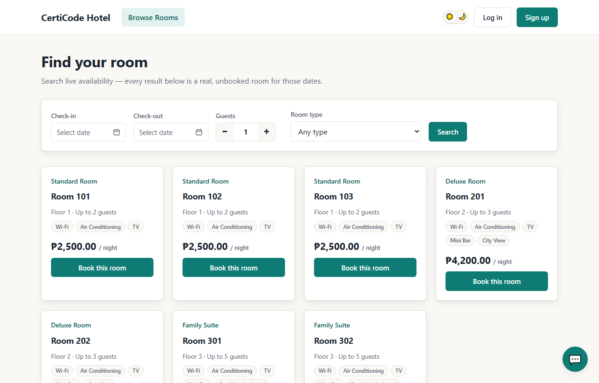
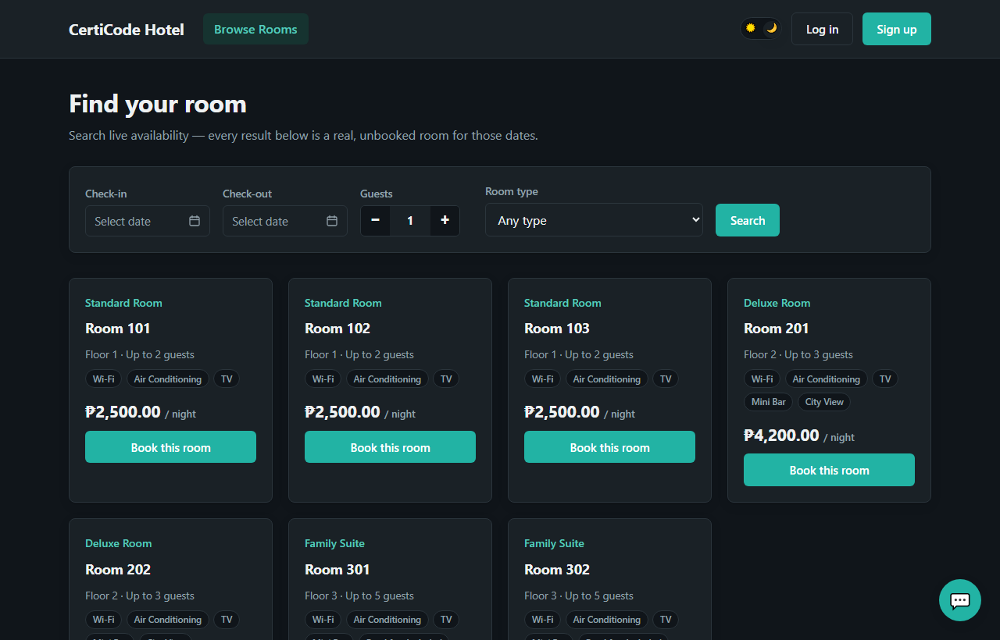
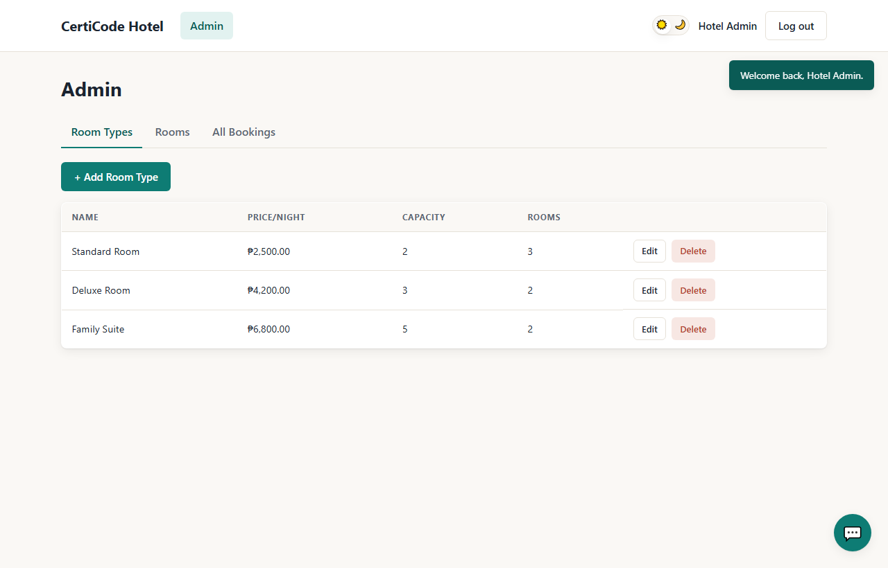
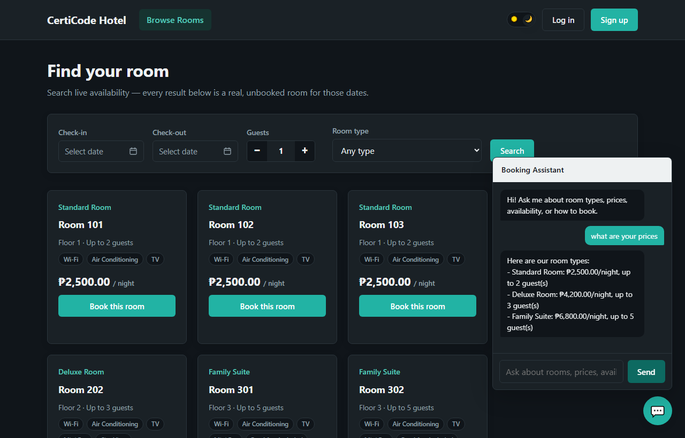

# CertiCode Hotel — Booking API

A full-stack hotel room booking system built with Laravel: a JWT-secured REST API, an admin back office, and a plain HTML/CSS/JS frontend with no build step. Built as a technical assessment to demonstrate the CertiCode core stack (Laravel, REST, MySQL) plus a few enhancements on top.

**🔗 Live demo:** [hotel-booking-api-9s54.onrender.com](https://hotel-booking-api-9s54.onrender.com/) — log in with the [demo accounts](#demo-accounts) below, or sign up.
> Hosted on Render's free tier, so the first request after idling can take ~30-60s to wake up.



## Features

- **Full CRUD** on room types, rooms, and bookings, with role-based access (customer vs. admin)
- **JWT authentication** (register, login, logout, token refresh)
- **Live availability search** — filter rooms by date range, guest count, and room type; a room only shows up if it has no overlapping booking for those dates
- **Double-booking prevention** enforced at the model layer, not just the UI
- **Booking status workflow** (pending → confirmed/cancelled/completed) with a notification badge that tells a guest when the hotel has updated their booking
- **Email confirmations** on new reservations, sent via [Resend](https://resend.com)
- **AI booking assistant** — a fast, free, deterministic keyword matcher handles common questions (prices, availability, how to book/cancel) by querying the database directly; anything else falls back to an LLM call (via [OpenRouter](https://openrouter.ai)), grounded with the real room data so it can't invent a room or price that doesn't exist
- **Light/dark theme**, a custom date-range picker, and a fully responsive layout — no CSS framework, no JS framework, no build step

|                        Dark mode                         |                        Admin panel                        |
| :--------------------------------------------------------: | :---------------------------------------------------------: |
|  |  |



## Tech stack

| Layer          | Choice                                                                 |
| -------------- | ----------------------------------------------------------------------- |
| Backend        | Laravel 12 / PHP 8.3, REST API                                          |
| Database       | MySQL, Eloquent ORM                                                     |
| Auth           | JWT (`php-open-source-saver/jwt-auth`)                                  |
| Frontend       | Vanilla HTML/CSS/JS served from a single Blade view — no npm build step |
| Email          | Resend                                                                   |
| AI             | OpenRouter (free-tier model), as a fallback behind rule-based matching  |
| Hosting        | [Render](https://render.com) (Docker), MySQL via Aiven                  |

**Why no frontend framework?** The assessment's core stack is Laravel/PHP/MySQL — no JS framework is listed. Plain HTML/CSS/JS served directly from Laravel deploys as the same single app, with nothing extra to compile.

## Getting started

### Prerequisites

- PHP 8.2+, Composer
- MySQL

### Installation

```bash
git clone <this-repo>
cd hotel-booking-system
composer install

cp .env.example .env
php artisan key:generate
php artisan jwt:secret

# Create a database, then set DB_DATABASE / DB_USERNAME / DB_PASSWORD in .env
php artisan migrate --seed

php artisan serve
```

Visit **http://127.0.0.1:8000**.

### Demo accounts

Seeded automatically by `php artisan migrate --seed`:

| Role     | Email             | Password |
| -------- | ----------------- | -------- |
| Admin    | admin@hotel.test  | password |
| Customer | guest@hotel.test  | password |

> `.test` is a reserved, non-routable TLD, so these accounts can't actually receive email — booking/status emails to them fail silently (logged, not shown). To see the real email confirmation flow on the [live demo](#certicode-hotel--booking-api), sign up with your own email address instead.

The seeder also creates 3 room types, 7 rooms, and 4 sample bookings — one in each status (pending/confirmed/cancelled/completed) — so every part of the UI has real data to show immediately.

### Optional: email and AI chatbot

The app runs fully without either of these — bookings still work, and the chatbot still answers the common questions. To enable the extras:

```env
# Real email delivery (leave MAIL_MAILER=log to just write emails to storage/logs/laravel.log)
MAIL_MAILER=resend
RESEND_API_KEY=            # from resend.com/api-keys
MAIL_FROM_ADDRESS=         # must be on a domain verified in your Resend account

# LLM fallback for the chatbot (skipped gracefully if left blank)
OPENROUTER_API_KEY=        # from openrouter.ai/keys
OPENROUTER_MODEL=nvidia/nemotron-3-ultra-550b-a55b:free
```

## API reference

All endpoints are prefixed with `/api`. Protected routes require `Authorization: Bearer <token>`.

| Method | Endpoint             | Auth       | Description                                    |
| ------ | --------------------- | ---------- | ----------------------------------------------- |
| POST   | `/register`           | —          | Create an account, returns a JWT                |
| POST   | `/login`              | —          | Returns a JWT                                   |
| POST   | `/logout`             | Any        | Invalidates the current token                   |
| POST   | `/refresh`            | Any        | Issues a new token                              |
| GET    | `/me`                 | Any        | Current user                                    |
| GET    | `/room-types`         | —          | List room types (search, price/capacity filter) |
| POST   | `/room-types`         | Admin      | Create a room type                              |
| PUT    | `/room-types/{id}`    | Admin      | Update a room type                              |
| DELETE | `/room-types/{id}`    | Admin      | Delete a room type                               |
| GET    | `/rooms`              | —          | List rooms (filter by dates, guests, type)      |
| POST   | `/rooms`              | Admin      | Create a room                                    |
| PUT    | `/rooms/{id}`         | Admin      | Update a room                                    |
| DELETE | `/rooms/{id}`         | Admin      | Delete a room                                    |
| GET    | `/bookings`           | Any        | Own bookings (admin sees all, with filters)     |
| POST   | `/bookings`           | Any        | Create a booking                                 |
| PUT    | `/bookings/{id}`      | Owner/Admin | Update dates/guests; only admin can change status |
| DELETE | `/bookings/{id}`      | Owner/Admin | Cancel a booking                                 |
| POST   | `/chatbot`             | —          | Ask the booking assistant a question             |

## Architecture notes

**Overlap prevention** lives in `Room::scopeAvailableBetween()` and `Booking::scopeOverlapping()` — a room is only "available" for a date range if no `pending`/`confirmed` booking on it overlaps that range. This is enforced server-side on every create/update, not just hidden from the search UI.

**The chatbot is two systems, not one.** `ChatbotService::reply()` tries keyword rules first — free, instant, and fully traceable to one line of code. Only when nothing matches does `askLlm()` call OpenRouter, and even then the prompt is grounded with the real room data and instructed never to invent a room, price, or policy. See [`app/Services/ChatbotService.php`](app/Services/ChatbotService.php).

**Admin and customer are separate contexts**, not one nav with conditional links bolted on — an admin never sees "My Bookings" (they use Admin → All Bookings instead) and lands on the Admin panel by default, not the guest-facing browse page.

## Deploying to Render

The live demo runs from [`render.yaml`](render.yaml) — a Blueprint that builds the [`Dockerfile`](Dockerfile) and deploys on push to `main`.

1. Create a Blueprint instance on Render from this repo; it reads `render.yaml` for the service config.
2. Fill in the secrets Render won't infer (`sync: false` in the blueprint): `APP_KEY`, `DB_HOST`/`DB_PORT`/`DB_DATABASE`/`DB_USERNAME`/`DB_PASSWORD`, `JWT_SECRET`, `RESEND_API_KEY`, `OPENROUTER_API_KEY`.
3. Verify a sending domain in Resend and set `MAIL_FROM_ADDRESS` to use it.
4. Push to `main` — Render builds the Docker image; migrations and the (idempotent) seeders run automatically on every boot, so demo data is always present, even after a cold start on the free plan.

---

Built as an internship technical assessment for CertiCode.
